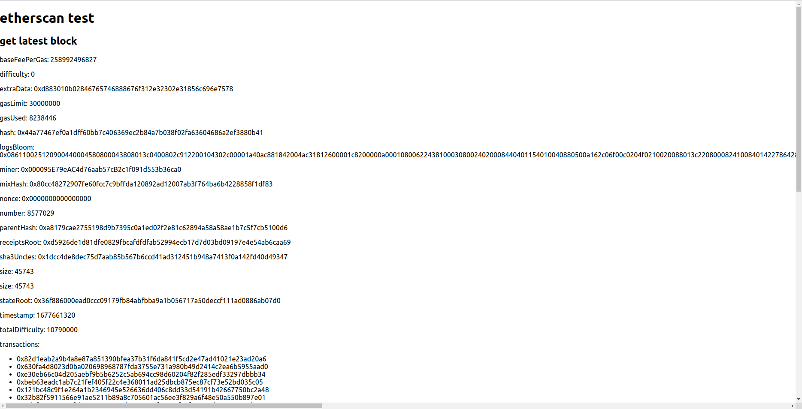

# front end
```
$ npx create-react-app etherscan-front
그리고, API 를 호출하기 위해서 axios 라는 라이브러리를 설치하세요.

$ cd etherscan-front
$ yarn add axios
```

# back end
```
npm install express
npm install web3
```
# etherscan


# img
